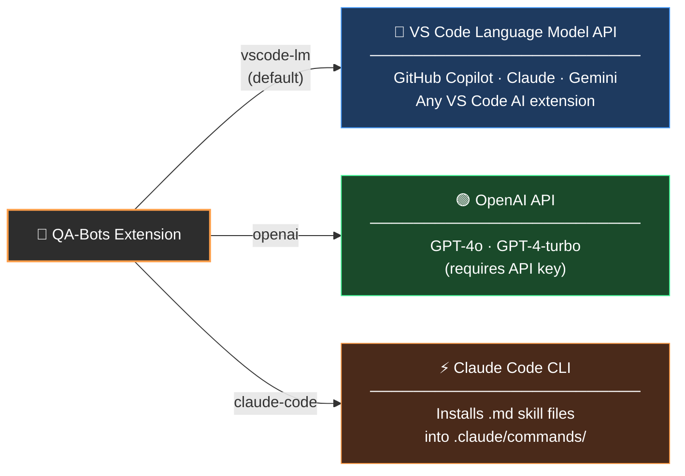
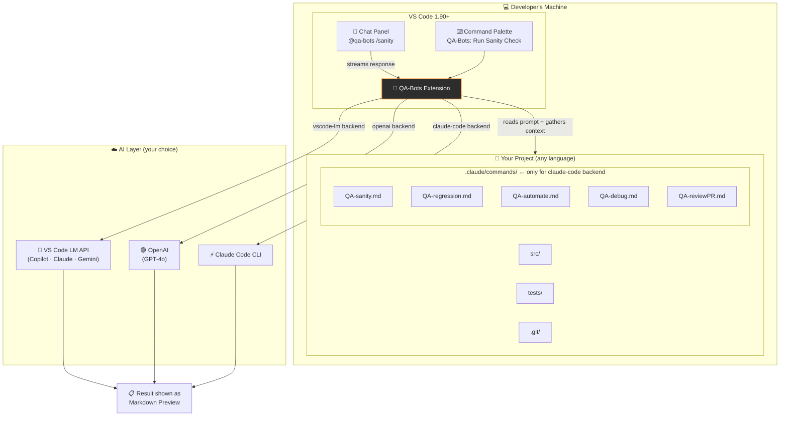
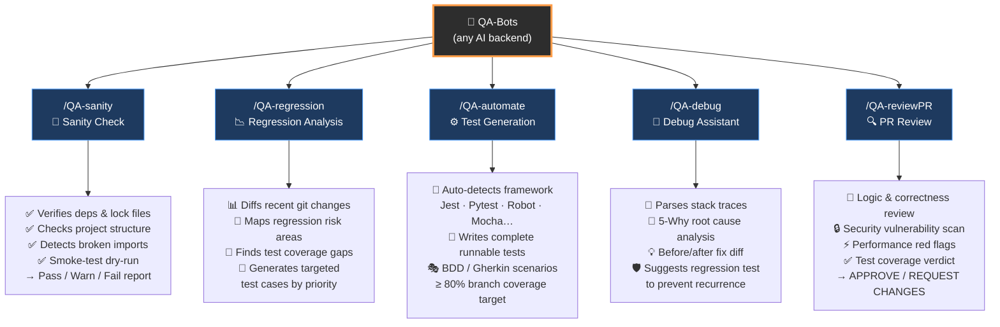
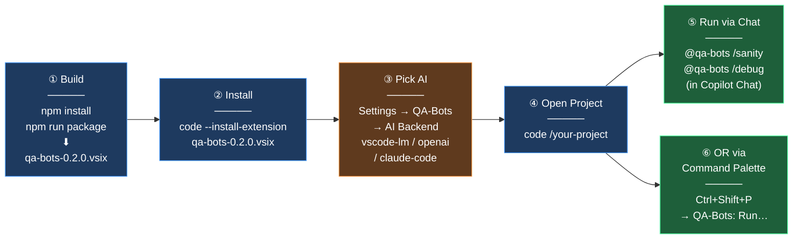
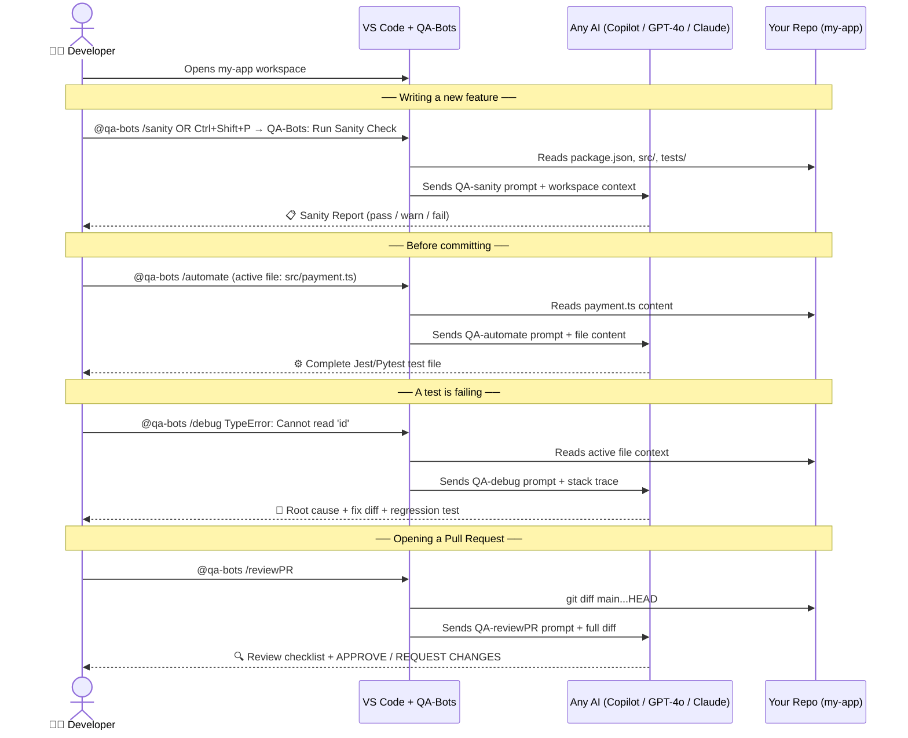

# QA-Bots — AI-Powered QA Extension for VS Code

> Works with **any AI** — GitHub Copilot, OpenAI GPT-4o, Claude, Gemini, and more.

Five QA assistants available directly in VS Code — no specific AI subscription required.

---

## Supported AI Backends



Switch backends any time via **VS Code Settings → QA-Bots → AI Backend**.

---

## System Architecture



---

## Commands & Benefits



---

## Step-by-Step User Journey



---

## Example: One Project, Real Dev Flow



---

## Commands

| Slash Command | Chat (`@qa-bots`) | Command Palette | Description |
|---|---|---|---|
| `/QA-sanity` | `/sanity` | QA-Bots: Run Sanity Check | Health-check deps, imports, structure |
| `/QA-regression` | `/regression` | QA-Bots: Run Regression Analysis | Risk analysis of recent git changes |
| `/QA-automate` | `/automate` | QA-Bots: Generate Automated Tests | Full test code for the active file |
| `/QA-debug` | `/debug <error>` | QA-Bots: Debug Errors | Root cause + fix for errors/failures |
| `/QA-reviewPR` | `/reviewPR` | QA-Bots: Review Pull Request | Full QA review of the branch diff |

---

## Step-by-Step: Install & Use

### Prerequisites

- [ ] **Node.js 18+**
- [ ] **VS Code 1.90+**
- [ ] At least **one** of:
  - **GitHub Copilot** extension (for `vscode-lm` backend — recommended, no extra setup)
  - **OpenAI API key** (for `openai` backend)
  - **Claude Code CLI** authenticated (for `claude-code` backend)

---

### Step 1 — Build & Install the Extension Locally

1. Clone this repository:
   ```bash
   git clone https://github.com/mredzmi/robotbdd.git
   cd robotbdd
   ```
2. Install dependencies and build:
   ```bash
   npm install
   npm run package
   ```
   This produces `qa-bots-0.2.0.vsix` in the project root.
3. Install in VS Code:
   ```bash
   code --install-extension qa-bots-0.2.0.vsix
   ```

---

### Step 2 — Pick Your AI Backend

Open VS Code Settings (`Ctrl+,`) and search **QA-Bots**:

| Setting | Value | Requirement |
|---|---|---|
| `qa-bots.aiBackend` | `vscode-lm` | GitHub Copilot or any VS Code AI extension |
| `qa-bots.aiBackend` | `openai` | Set `qa-bots.openaiApiKey` to your OpenAI key |
| `qa-bots.aiBackend` | `claude-code` | Claude Code CLI installed and `claude login` done |

> **Recommended:** Leave it as `vscode-lm`. If you have GitHub Copilot, it works out of the box.

---

### Step 3 — Open Your Project

```bash
code /path/to/your-project
```

---

### Step 4 — Run a QA-Bot

**Option A — Chat panel** (GitHub Copilot or any VS Code AI chat):

Open the Chat panel (`Ctrl+Alt+I`) and type:
```
@qa-bots /sanity
@qa-bots /regression
@qa-bots /automate
@qa-bots /debug TypeError: Cannot read 'id' at src/users.ts:42
@qa-bots /reviewPR
```

**Option B — Command Palette**:

Press `Ctrl+Shift+P` and search:
```
QA-Bots: Run Sanity Check
QA-Bots: Run Regression Analysis
QA-Bots: Generate Automated Tests
QA-Bots: Debug Errors & Failing Tests
QA-Bots: Review Pull Request
```

Results open as a **Markdown Preview** panel beside your code.

---

### Step 5 — Review the Output

Example output from `/QA-sanity`:

```
## QA Sanity Report

### ✅ Passed
- package.json found with lock file
- All imports resolve correctly

### ⚠️ Warnings
- 3 TODO comments found in critical paths

### ❌ Failed
- Missing .env.example file

### Recommendation
Add .env.example to document required environment variables...
```

---

### Step 6 — (Optional) Customise a Prompt

The QA prompts are plain Markdown files bundled with the extension at `commands/*.md`. To customise for your project, copy the relevant file to your workspace:

```
.claude/commands/QA-automate.md   ← edit this to always use Pytest
```

Or run **QA-Bots: Install Claude Code Commands** from the Command Palette to copy all five files at once.

---

## Settings Reference

| Setting | Default | Description |
|---|---|---|
| `qa-bots.aiBackend` | `vscode-lm` | `vscode-lm` · `openai` · `claude-code` |
| `qa-bots.vscodeLmFamily` | `""` | Preferred model family (e.g. `gpt-4o`, `claude-sonnet`) |
| `qa-bots.openaiApiKey` | `""` | Your OpenAI secret key |
| `qa-bots.openaiModel` | `gpt-4o` | OpenAI model to call |
| `qa-bots.autoInstallOnActivation` | `true` | Auto-copy `.md` files (claude-code mode only) |
| `qa-bots.testFramework` | `auto` | Force a test framework for `/QA-automate` |

---

## Requirements

- Node.js 18+
- VS Code 1.90.0 or later
- One of: GitHub Copilot · OpenAI API key · Claude Code CLI

---

## Development

```bash
npm install
npm run compile        # one-off TypeScript build
npm run watch          # watch mode during development
npm run package        # produce .vsix bundle
```
