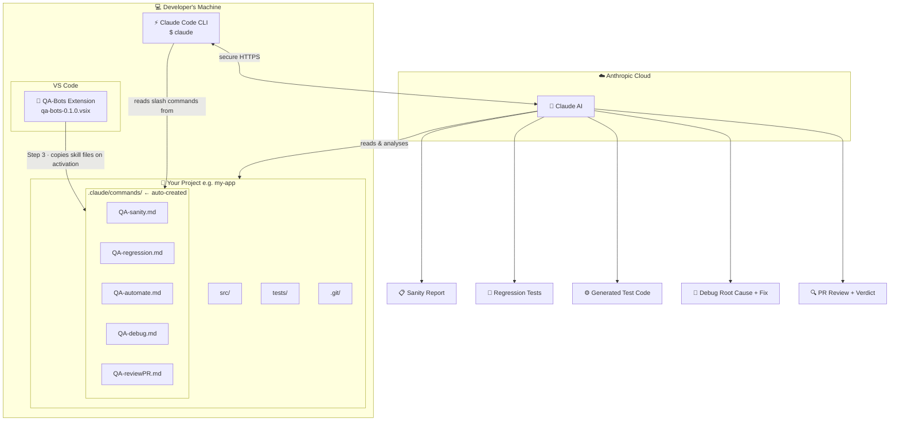
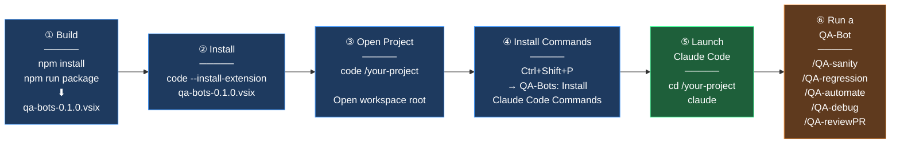
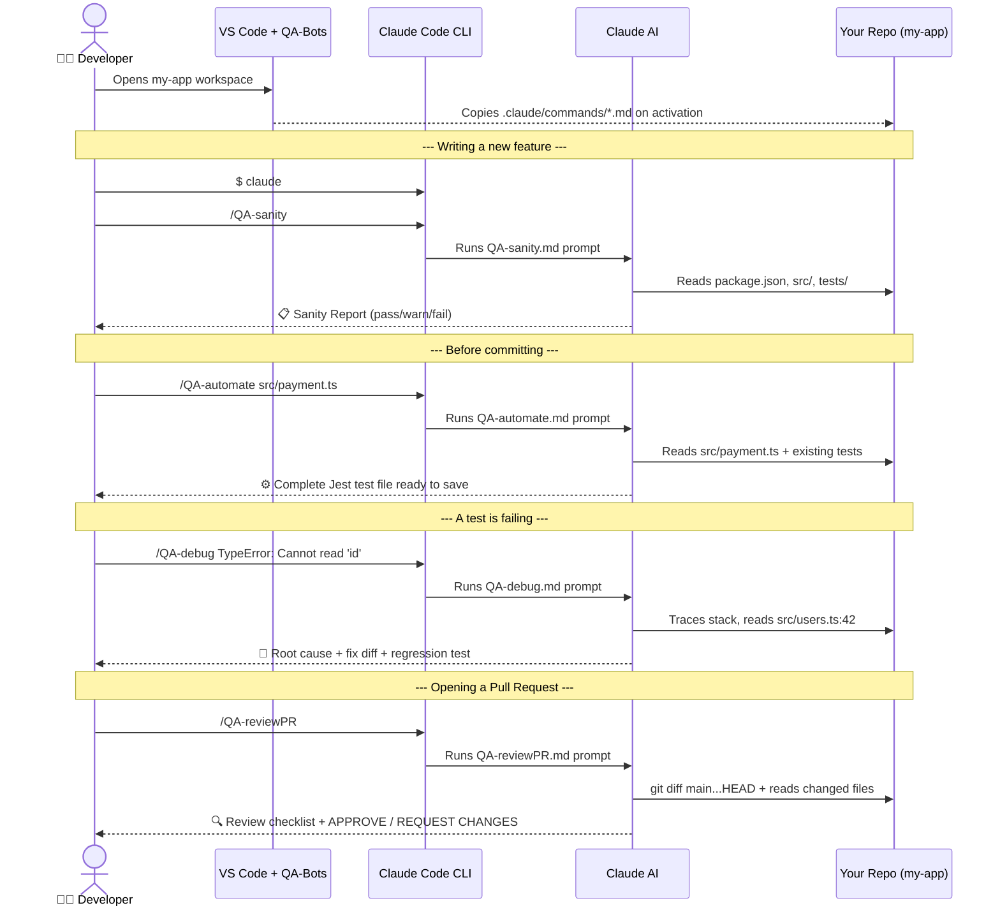

# QA-Bots — Claude Code VSCode Extension

A VSCode extension that installs **QA-Bot slash commands** into your Claude Code workspace, giving you AI-powered QA assistants directly inside Claude Code CLI.

---

## How It Works — System Architecture



---

## Step-by-Step User Journey



---

## Commands & Benefits

```mermaid
flowchart TD
    EXT["🤖 QA-Bots Extension"]

    EXT --> SANITY["/QA-sanity\n🏥 Sanity Check"]
    EXT --> REGRESSION["/QA-regression\n📉 Regression Analysis"]
    EXT --> AUTOMATE["/QA-automate\n⚙️ Test Generation"]
    EXT --> DEBUG["/QA-debug\n🐛 Debug Assistant"]
    EXT --> REVIEWPR["/QA-reviewPR\n🔍 PR Review"]

    SANITY --> S1["✅ Verifies deps & lock files"]
    SANITY --> S2["✅ Checks project structure"]
    SANITY --> S3["✅ Detects broken imports"]
    SANITY --> S4["✅ Smoke-test dry-run\n→ Pass / Warn / Fail report"]

    REGRESSION --> R1["📊 Diffs recent git changes"]
    REGRESSION --> R2["🎯 Maps regression risk areas"]
    REGRESSION --> R3["🔎 Finds test coverage gaps"]
    REGRESSION --> R4["🧪 Generates targeted\ntest cases by priority"]

    AUTOMATE --> A1["🔎 Auto-detects framework\nJest · Pytest · Robot · Mocha…"]
    AUTOMATE --> A2["📝 Writes complete runnable tests"]
    AUTOMATE --> A3["🎭 BDD / Gherkin scenarios"]
    AUTOMATE --> A4["≥ 80% branch coverage target"]

    DEBUG --> D1["📜 Parses stack traces"]
    DEBUG --> D2["🌳 5-Why root cause analysis"]
    DEBUG --> D3["💡 Before/after fix diff"]
    DEBUG --> D4["🛡️ Suggests regression test\nto prevent recurrence"]

    REVIEWPR --> P1["🐛 Logic & correctness review"]
    REVIEWPR --> P2["🔒 Security vulnerability scan"]
    REVIEWPR --> P3["⚡ Performance red flags"]
    REVIEWPR --> P4["✅ Test coverage verdict\n→ APPROVE / REQUEST CHANGES"]

    style EXT fill:#2d2d2d,color:#fff,stroke:#ff9e4a,stroke-width:3px
    style SANITY fill:#1e3a5f,color:#fff,stroke:#4a9eff
    style REGRESSION fill:#1e3a5f,color:#fff,stroke:#4a9eff
    style AUTOMATE fill:#1e3a5f,color:#fff,stroke:#4a9eff
    style DEBUG fill:#1e3a5f,color:#fff,stroke:#4a9eff
    style REVIEWPR fill:#1e3a5f,color:#fff,stroke:#4a9eff
```



---

## Example: One Developer, One Project



---

## Commands

| Slash Command      | Description |
|--------------------|-------------|
| `/QA-sanity`       | Run a quick sanity check on your codebase — imports, deps, env, smoke tests |
| `/QA-regression`   | Analyse recent changes for regression risk and generate targeted test cases |
| `/QA-automate`     | Generate automated test cases (Jest, Pytest, Robot Framework, BDD, etc.) |
| `/QA-debug`        | Debug errors and failing tests — root-cause analysis + fix suggestions |
| `/QA-reviewPR`     | Review a pull request for quality, bugs, and missing test coverage |

---

## Step-by-Step: Install & Use

### Prerequisites

Before you start, make sure you have:

- [ ] **Node.js 18+** — [download here](https://nodejs.org)
- [ ] **VS Code 1.85+** — [download here](https://code.visualstudio.com)
- [ ] **Claude Code CLI** installed and authenticated:
  ```bash
  npm install -g @anthropic-ai/claude-code
  claude login
  ```

---

### Step 1 — Build & Install the Extension Locally

1. Clone this repository:
   ```bash
   git clone https://github.com/mredzmi/robotbdd.git
   cd robotbdd
   ```
2. Install dependencies and build the package:
   ```bash
   npm install
   npm run package
   ```
   This produces a file like `qa-bots-0.1.0.vsix` in the project root.
3. Install it in VS Code:
   ```bash
   code --install-extension qa-bots-0.1.0.vsix
   ```
   Or drag-and-drop the `.vsix` file into the VS Code Extensions panel.

---

### Step 2 — Open Your Project

Open the folder you want to run QA checks on:

```bash
code /path/to/your-project
```

> The extension works on a per-workspace basis. Always open the **root folder** of your project, not a subfolder.

---

### Step 3 — Install the Claude Code Commands

The extension needs to copy its QA skill files into your project's `.claude/commands/` folder so Claude Code can find them.

1. Press `Ctrl+Shift+P` (Windows/Linux) or `Cmd+Shift+P` (Mac) to open the Command Palette.
2. Type **QA-Bots: Install Claude Code Commands** and press `Enter`.
3. You will see a notification:
   > *QA-Bots: Installed 5 Claude Code command(s) into .claude/commands*

Your project now contains:

```
your-project/
└── .claude/
    └── commands/
        ├── QA-sanity.md
        ├── QA-regression.md
        ├── QA-automate.md
        ├── QA-debug.md
        └── QA-reviewPR.md
```

> **Tip:** The extension also does this automatically every time VS Code starts (controlled by the `qa-bots.autoInstallOnActivation` setting).

---

### Step 4 — Open Claude Code in Your Project

In a terminal, navigate to your project root and launch Claude Code:

```bash
cd /path/to/your-project
claude
```

Claude Code will start and automatically detect the `.claude/commands/` folder.

---

### Step 5 — Run a QA-Bot Command

Inside the Claude Code prompt, type any of the following slash commands and press `Enter`:

#### `/QA-sanity`
Performs a full health check of your project — dependencies, structure, imports, config files, and smoke tests.
```
/QA-sanity
```

#### `/QA-regression`
Analyses your recent git changes, identifies regression risk areas, and generates targeted test cases.
```
/QA-regression
```

#### `/QA-automate`
Auto-detects your test framework and generates complete, runnable test code. Optionally pass a file:
```
/QA-automate src/services/payment.ts
```

#### `/QA-debug`
Paste an error or stack trace — the bot traces the root cause and suggests a concrete fix:
```
/QA-debug TypeError: Cannot read properties of undefined (reading 'id')
    at getUserById (src/users.ts:42:18)
```

#### `/QA-reviewPR`
Reviews the diff between your current branch and `main`:
```
/QA-reviewPR
```

---

### Step 6 — Review the Output

Each bot produces a structured report. Example from `/QA-sanity`:

```
## QA Sanity Report

### ✅ Passed
- package.json found with lock file
- All imports resolve correctly
- No secrets committed to git

### ⚠️ Warnings
- 3 TODO comments found in critical paths

### ❌ Failed
- Missing .env.example file

### Recommendation
Add an .env.example documenting required environment variables...
```

---

### Step 7 — (Optional) Customise a Bot

The skill files in `.claude/commands/` are plain Markdown — edit them to suit your project.

1. Open `.claude/commands/QA-automate.md` in VS Code.
2. Add project-specific instructions (e.g. *"Always use Pytest"*).
3. Save. The change takes effect immediately.

---

## Settings

| Setting | Default | Description |
|---|---|---|
| `qa-bots.autoInstallOnActivation` | `true` | Copy command files to workspace on VS Code startup |
| `qa-bots.testFramework` | `"auto"` | Force a specific test framework for `/QA-automate` (`jest`, `vitest`, `pytest`, `robot`, `mocha`, `jasmine`, `junit`) |

To change settings: `Ctrl+,` → search **QA-Bots**.

---

## Requirements

- Node.js 18+
- VS Code 1.85.0 or later
- [Claude Code CLI](https://github.com/anthropics/claude-code) installed and authenticated

---

## Development

```bash
npm install
npm run compile        # one-off TypeScript build
npm run watch          # watch mode during development
npm run package        # produce .vsix bundle for distribution
```
